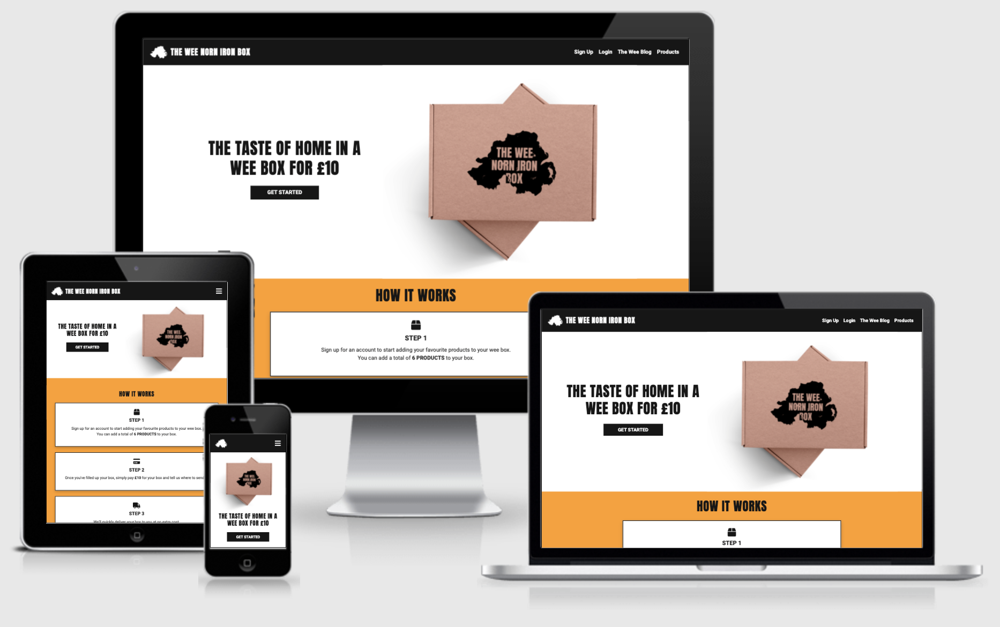
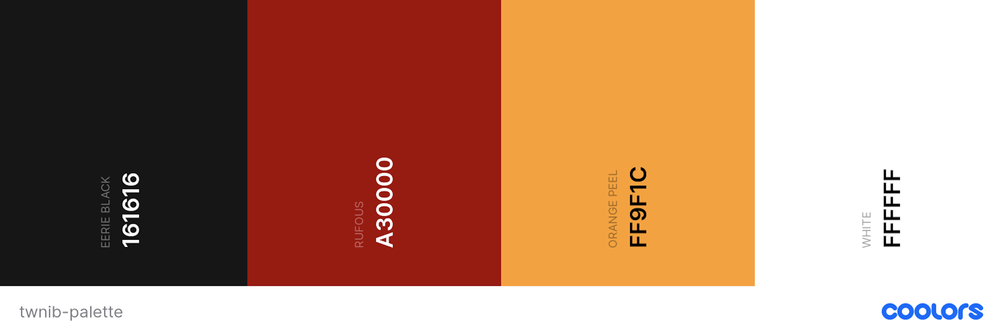
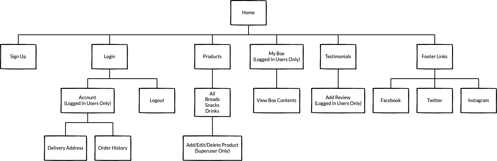
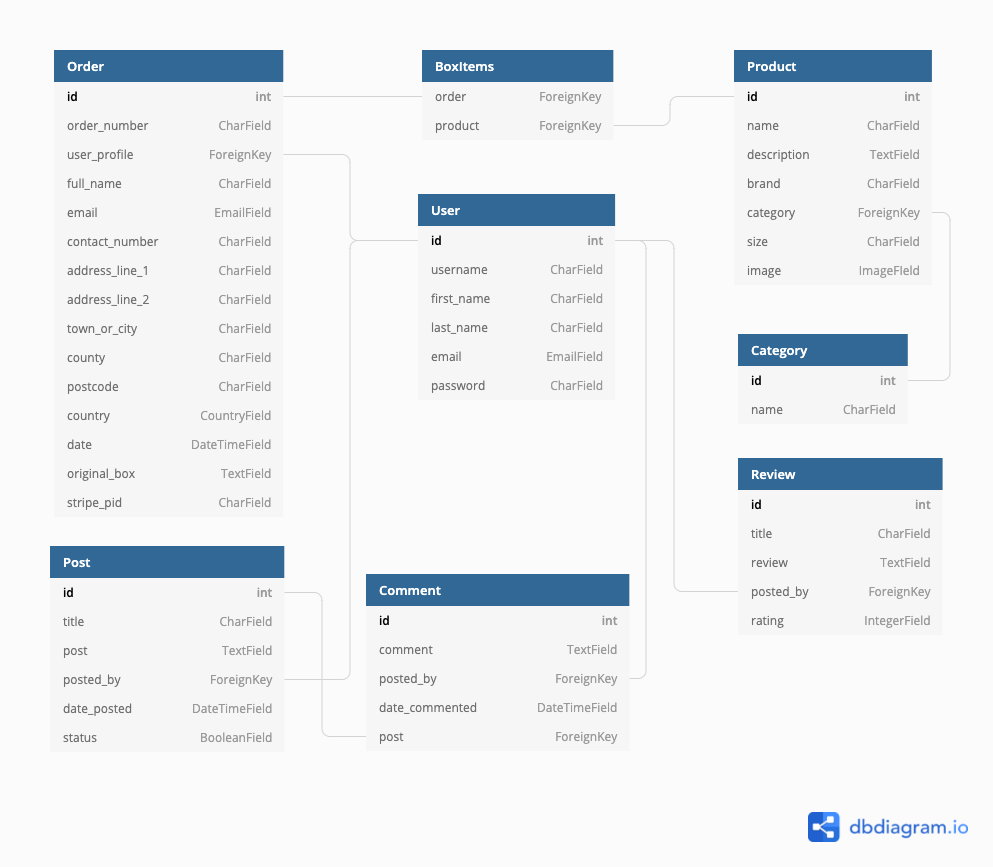

# The Wee Norn Iron Box

The Wee Norn Iron Box is a snack box service that will allow registered users to choose from a selection of different Northern Irish treats to be posted to them in a 'wee' box.



The image above is a screenshot of the site displayed on different devices using [Am I Responsive](http://ami.responsivedesign.is/).

A demo of the project can be found here: [The Wee Norn Iron Box](https://the-wee-norn-iron-box.herokuapp.com/)

## Contents

- [**User Experience**](#user-experience)
  - Project Goals
  - User Stories
    - First Time Visitor
    - Registered User
    - Superuser
  - Design
    - Colour Scheme
    - Typography
    - Imagery
  - Wireframes

- [**Database Models**](#database-models)

- [**Features**](#features)
  - Existing Features
  - Features left to be implemented

- [**Technologies Used**](#technologies-used)
  - Languages
  - Frameworks, Libraries and Programs
  - Dependencies

- [**Deployment**](#deployment)
  - Github
  - Heroku
  - Cloning the Repository

- [**Credits**](#credits)
  - Code
  - Content
  - Media
  - Acknowledgements

---

## User Experience

### Project Goals

The goal of this project is to create a snack box service that will allow registered users to choose from a range of drinks, foods and snacks that are only available in Northern Ireland. The project is aimed at anyone who lives/studies/works abroad or elsewhere in the UK, and misses the taste of home!

Registered users will receive a box containing 6 of their chosen Northern Irish goods all for the price of £10, including fast and free delivery.

### User Stories

#### First Time Visitor

- As a **First Time Visitor**, I want to understand the main purpose of the site on my first visit
- As a **First Time Visitor**, I want to be able to easily navigate the site
- As a **First Time Visitor**, I want to be able to easily view/use the site on my smartphone
- As a **First Time Visitor**, I want to be able to see what products are available to add to a snack box
- As a **First Time Visitor**, I want to know the snack box price
- As a **First Time Visitor**, I want to be able to read blog posts
- As a **First Time Visitor**, I want to be able to easily register for an account
- As a **First Time Visitor**, I want to read reviews from other users
- As a **First Time Visitor**, I want to be able to follow the company on social media platforms
- As a **First Time Visitor**, I want to be able to contact the company with any queries I might have

#### Registered User

- As a **Registered User**, I want to be able to easily login and logout of my account
- As a **Registered User**, I want to be able to easily add and remove items from my box
- As a **Registered User**, I want to be able to easily purchase my box
- As a **Registered User**, I want to receive an email confirming my purchase
- As a **Registered User**, I want to be able to easily update my delivery details in my profile
- As a **Registered User**, I want to be able to view my order history
- As a **Registered User**, I want to be able to easily submit blog posts
- As a **Registered User**, I want to be able to easily edit or delete any blog posts I've submitted
- As a **Registered User**, I want to be able to comment on other blog posts
- As a **Registered User**, I want to be able to leave a review on the site to let others know about my experience

#### Site Owner/Superuser

- As a **Site Owner/Superuser**, I want to be able to add new products
- As a **Site Owner/Superuser**, I want to be able to edit and delete products
- As a **Site Owner/Superuser**, I want to be able to manage user reviews
- As a **Site Owner/Superuser**, I want to be able to view and manage all blog posts
- As a **Site Owner/Superuser**, I want to be able to access the admin panel to view registered users order details so I know what products to add to their box

### Design

#### Colour Scheme

The overall design of this project is simple and easy to follow, using block shapes with sharp edges and defined borders to display most of the content, mimicking that of a box.


_Colour palette generated using [coolors.co](https://coolors.co)_

The colour palette for this project is based on the colours of the Harland and Wolff cranes in Belfast, Northern Ireland.

-  `#161616`:
  - Used as the background colour for the navbar and footer as well as the colour for text and buttons
-  `#A30000`:
  - Used as the hover colour for buttons
-  `#FF9F1C`:
  - Used as the main background colour across all pages
-  `#FFFFFF`:
  - Used as the background colour for page headings and cards

#### Typography

Throughout the site, I used two different fonts from Google Fonts. These were [Anton](https://fonts.google.com/specimen/Anton#standard-styles) with the suggested pairing of [Roboto](https://fonts.google.com/specimen/Roboto).

The Anton font was used for all main headings on the site and as the font for the logo text, with Roboto being used for all other text.

#### Imagery

The images used for this project are product images sourced from a variety of different websites. As this project is for educational purposes, I have credited the websites at the bottom of this document in the [credits](#credits) section. The product images used are of well known Northern Irish/Irish brands including [Tayto](https://www.tayto.com/) and [Maine Lemonade](https://www.mainesoftdrinks.co.uk/).

I designed a simple logo for the site using [Affinity Photo](https://affinity.serif.com/en-gb/photo/). The logo is made up of an outline of the map of Northern Ireland and some text with the name of the site - "The Wee Norn Iron Box". I then downloaded a PSD box mock-up from [Free Pik](https://www.freepik.com/) and added the logo to the box to use on the landing page. The outline of the map of Northern Ireland is also used for site favicon.

I also used [Affinity Photo](https://affinity.serif.com/en-gb/photo/) to create a simple **No Image Available** image that will display if there isn't an image available for a product.

#### Wireframes (**UPLOAD THESE!!!**)

The wireframes for my site were created using [Balsamiq](https://balsamiq.com/). I created wireframes for mobile, tablet and desktop devices.



Links to the wireframes can be found below. Each link contains the wireframes for mobile, tablet and desktop devices:

- [Home Page](https://github.com/KirstChat/the-wee-norn-iron-box/blob/master/docs/wireframes/home.pdf)
- [Products Page](https://github.com/KirstChat/the-wee-norn-iron-box/blob/master/docs/wireframes/products.pdf)
- [Add/Edit/Delete Products](https://github.com/KirstChat/the-wee-norn-iron-box/blob/master/docs/wireframes/add-edit-delete-products.pdf) _(Superuser Only)_
- [Box Contents](https://github.com/KirstChat/the-wee-norn-iron-box/blob/master/docs/wireframes/box.pdf)
- Checkout
- User Profile
- Add Review
- Login/Sign Up

There aren't any wireframes for the blog app as this was a suggested feature to add later in the development process. There also aren't any wireframes for the error pages as I decided to add these later in the development process.

[Contents](#contents)

---

## Database Models

[SQLite3](https://www.sqlite.org/index.html) was used in development as part of the Django framework and [Heroku Postgres](https://www.heroku.com/postgres) was used for Production. The models used in the project can be found below:


_DB Diagram created using [dbdiagram.io](https://dbdiagram.io/) to show the relationships between models_

**Home App:**

Review Model

| Field | Field Type | Field Options |
| --- | --- | --- |
| title | CharField | max_length=50, null=True, blank=True |
| review | TextField | null=True, blank=True |
| posted_by | ForeignKey | User, on_delete=models.CASCADE |
| rating | IntegerField | default=0, validators=[MinValueValidator(1),MaxValueValidator(5)] |

**Products App:**

Category Model

| Field | Field Type | Field Options |
| --- | --- | --- |
| name | CharField | max_length=200 |

Product Model

| Field | Field Type | Field Options |
| --- | --- | --- |
| name | CharField | max_length=254, null=True |
| description | TextField | null=True, blank=True |
| brand | CharField | max_length=254, null=True, blank=True |
| category | ForeignKey | 'Category', null=True, blank=True, on_delete=models.SET_NULL |
| size | CharField | max_length=25, null=True, blank=True |
| image | ImageField | null=True, blank=True |

**Checkout App:**

Order Model

| Field | Field Type | Field Options |
| --- | --- | ---|
| order_number | CharField | max_length=32, null=False, editable=False |
| user_profile | ForeignKey | UserProfile, on_delete=models.SET_NULL, null=True, blank=False, related_name='orders' |
| full_name | CharField | max_length=80, null=False, blank=False |
| email | EmailField | max_length=254, null=False, blank=False |
| contact_number | CharField | max_length=20, null=True, blank=True |
| address_line_1 | CharField | max_length=80, null=False, blank=False |
| address_line_2 | CharField | max_length=80, null=False, blank=False |
| town_or_city | CharField | max_length=80, null=True, blank=True |
| county | CharField | max_length=80, null=True, blank=True |
| postcode | CharField | max_length=20, null=False, blank=False |
| country | CountryField | blank_label="Country *", null=False, blank=False |
| date | DateTimeField | auto_now_add=True |
| original_box | TextField | null=False, blank=False, default='' |
| stripe_pid | CharField | max_length=254, null=False, blank=False, default='' |

Box Items Model

| Field | Field Type | Field Options |
| --- | :--- | ---|
| order | ForeignKey | Order, null=False, blank=False, on_delete=models.CASCADE, related_name="boxitems" |
| product | ForeignKey | Product, null=False, blank=False, on_delete=models.CASCADE |

**Blog App**:

Post Model

| Field | Field Type | Field Options |
| --- | --- | --- |
| title | CharField | max_length=254, null=False, blank=False |
| post | TextField | null=False, blank=False |
| posted_by | ForeignKey | User, on_delete=models.CASCADE |
| date_posted | DateTimeField | auto_now_add=True |
| status | BooleanField | choices=STATUS, default=1 |

Comment Model

| Field | Field Type | Field Options |
| --- | --- | --- |
| comment | TextField | null=False, blank=False |
| posted_by | ForeignKey | User, on_delete=models.CASCADE |
| date_commented | DateTimeField | auto_now_add=True |
| post | ForeignKey | Post, on_delete=models.CASCADE, related_name="comments" |

[Contents](#contents)

---

## Features

### Existing Features

- Responsive on all devices with a mobile-first design using Bootstrap
- An easy to use navigation bar located at the top of every page with a toggle button to trigger the nav on mobile devices
- A home page with an about section that explains the purpose of the site
- Login, Log Out and Sign Up functionality
- Add, Edit and Delete functionality for superusers
- A reviews section on the home page that displays reviews left by users and allows logged in users to leave their own review
- A products page with a search bar and category filters
- Product descriptions that display when the user hovers over the product card
- A box page to allow the user to see the contents of their box before they order
- A profile page that displays previous orders and a saved delivery address for future orders as well as blog post drafts
- A checkout page that allows the user to purchase their box using Stripe payments
- A blog page that displays blog posts and allows users to create their own posts as well as comment on other posts
- A footer located on every page with links to social media pages
- Toasts to let the user know when they've successfully completed an action or to let them know if there was a error completing an action

### Features Left to be Implemented

In future releases of this project and as I continue to progress as a developer, I would like to add some additional features to improve the users overall experience:

- Subscription Payment Option:
  - I initially wanted to make this project a subscription box service but due to work commitments and time restraints, I opted for a single payment service to meet the project requirements
  - In future, I would like to try adding the stripe subscription payments again as this feature would allow users to have the option to receive a box every month rather than having to log on each time they wish to purchase one
  - Along with this, I would also like to give users the option to pause or stop their subscription at any time

- Multiple Payment Options:
  - This feature would give users various options to pay for their box or subscription using Apple Pay or Google Pay

- Additional Account Options:
  - I would like to give the user the option to create an account by logging in with one of their social accounts such as Facebook or Google
  - I would also like to give the user the option to delete their account if they no longer wish to use the service

[Contents](#contents)

---

## Technologies Used

### Languages

- [HTML](https://developer.mozilla.org/en-US/docs/Web/HTML)
- [CSS](https://developer.mozilla.org/en-US/docs/Web/CSS)
- [JavaScript](https://developer.mozilla.org/en-US/docs/Web/JavaScript)
- [Python](https://www.python.org/)

### Frameworks, Libraries and Tools

- [Affinity Photo](https://affinity.serif.com/en-gb/photo/)
  - Affinity Photo was used to design a simple logo for the site and to add the logo to a box mock-up PSD
- [AWS Amazon S3](https://aws.amazon.com/s3/)
  - Amazon S3 _(Amazon Simple Storage Service)_ was used to store static and media files used in the project
- [Balsamiq](https://balsamiq.com/)
  - Balsamiq was used to create the wireframes for desktop, tablet and mobile during the design process
- [Bootstrap](https://getbootstrap.com/docs/5.0/getting-started/introduction/)
  - Bootstrap v5.0 was used to give the site a simple, responsive layout and to also add various Bootstrap components and utilities
- [Django](https://www.djangoproject.com/)
  - Django was the web framework used to build the project
- [Djecrety](https://djecrety.ir/)
  - Djecrety was used generate a secret key
- [Font Awesome](https://fontawesome.com/)
  - Font Awesome was used to add various icons throughout the site
- [Google Fonts](https://fonts.google.com/)
  - Google Fonts was used to add [Anton](https://fonts.google.com/specimen/Anton#standard-styles) and [Roboto](https://fonts.google.com/specimen/Roboto) to the site
- [Git](https://git-scm.com/)
  - Git was used for version control by utilising the terminal in VS Code to commit to Git and push to GitHub. Git was also used to create branches to test new features before merging with the master branch
- [GitHub](https://github.com/)
  - GitHub was used to store the project code that was pushed from VS Code
- [Heroku](https://www.heroku.com/)
  - Heroku is a cloud platform that was used to deploy and run the application from the GitHub repository
- [Ngrok](https://ngrok.com/)
  - Ngrok was used to setup an online tunnel to locally test the webhook endpoint in Stripe
- [Stripe](https://stripe.com/docs)
  - Stripe was used to integrate online payment processing
- [VS Code](https://code.visualstudio.com/)
  - Visual Studio Code was the editor used to code the project

### Dependencies

- [django-allauth](https://django-allauth.readthedocs.io/en/latest/overview.html)
  - Integrated set of Django applications addressing authentication, registration, account management as well as 3rd party (social) account authentication
- [Pillow](https://pillow.readthedocs.io/en/stable/)
  - Python imaging library
- [Django Countries](https://pypi.org/project/django-countries/)
  - A Django application that provides country choices for use with forms, flag icons static files, and a country field for models
- [Django Crispy Forms](https://django-crispy-forms.readthedocs.io/en/latest/)
  - The best way to have Django DRY forms. Build programmatic reusable layouts out of components, having full control of the rendered HTML without writing HTML in templates
- [Crispy Bootstrap 5](https://github.com/django-crispy-forms/crispy-bootstrap5)
  - Bootstrap5 template pack for django-crispy-forms
- [Stripe](https://stripe.com/docs)
  - A Python library for Stripe’s API
- [dj-stripe](https://dj-stripe.readthedocs.io/en/master/)
  - dj-stripe implements all of the Stripe models, for Django
- [dj_database_url](https://pypi.org/project/dj-database-url/)
  - This simple Django utility allows you to utilize the 12factor inspired DATABASE_URL environment variable to configure your Django application
- [psycopg2-binary](https://pypi.org/project/psycopg2-binary/)
  - Psycopg is the most popular PostgreSQL database adapter for the Python programming language
- [gunicorn](https://pypi.org/project/gunicorn/)
  - Gunicorn ‘Green Unicorn’ is a Python WSGI HTTP Server for UNIX
- [boto3](https://boto3.amazonaws.com/v1/documentation/api/latest/index.html)
  - Use the AWS SDK for Python (Boto3) to create, configure, and manage AWS services, such as Amazon Elastic Compute Cloud (Amazon EC2) and Amazon Simple Storage Service (Amazon S3)
- [django-storages](https://django-storages.readthedocs.io/en/latest/)
  - A collection of custom storage backends for Django

[Contents](#contents)

---

## Testing

Further Testing information can be found in a separate document: [TESTING.md](TESTING.md)

[Contents](#contents)

---

## Deployment

This project was developed on macOS using VS Code, with Git and GitHub used for version control. The project is hosted on Heroku, and all static and media files are stored on AWS Amazon S3.

### Cloning the Repository

To clone the repository and make a local copy on your computer, follow these steps:

- Open GitHub and locate the GitHub repository: [https://github.com/KirstChat/the-wee-norn-iron-box](https://github.com/KirstChat/the-wee-norn-iron-box)
- Under the repository name, click **"Code"** and copy the link to clone the repository using **"HTTPS"**
- After copying the link, open a terminal on your computer - this step can also be done in the terminal in your preferred IDE or Code Editor
- Change the current working directory to the location where you want the cloned directory to be saved
- Type ```git clone```, and then paste the URL: [https://github.com/KirstChat/the-wee-norn-iron-box.git](https://github.com/KirstChat/the-wee-norn-iron-box.git)
- Press Enter to create a local clone
- Create a **env.py** file to store environment variables
- Add the **env.py** file and the virtual environment folder (**"venv"**) to a **".gitignore"** file to ensure this information isn't pushed to the repository on GitHub
- Before installing any required dependencies, create a virtual environment - this will ensure that packages installed are only installed in the virtual environment folder: ```python3 -m venv venv```
- Run the following command to ensure you are installing packages in the virtual environment and not on your local drive: ```source ./venv/bin/activate```
- Install the required dependencies from the **"requirements.txt"** file to run the repository locally: ```pip3 install requirements.txt```
- Run the app from your local IDE or Code Editor by running the following command in the terminal: ```python3 manage.py runserver```

### GitHub

This project was coded in VS Code and pushed to GitHub using the following steps:

- Create a new folder in your preferred area in your local drive
- Open the folder in VS Code to start creating files
- Open source control in VS Code and select **"Publish to GitHub"**
- If prompted, sign into GitHub to connect your account to VS Code if you haven't done so already
- In source control, select **"Publish to GitHub"**
- Give your repository a name and select **"Publish to GitHub Public Repository"**
- After the repository is successfully published to GitHub, you can use git bash to add, commit and push any changes to the GitHub repository
- To stage a file to commit, use ```git add``` and the name of the file you want to commit or alternatively, use ```git add .``` to add all files to the staging area
- After adding a file to commit, use ```git commit -m "add commit message here"``` to specify what changes you have made to that file
- After committing a file, use ```git push``` to push all staged changes to the GitHub repository

### Heroku

The following steps were used to host the project on Heroku:

- Before creating a Heroku app, open the repository in VS Code and create a requirements file that lists all the applications and dependencies required to run the application: ```pip3 freeze --local > requirements.txt```
- Create a Heroku specific file called a Procfile - this is what Heroku looks for to know which file runs the app and how to run it: ```web: gunicorn the_wee_norn_iron_box:application```
- Open [Heroku](www.heroku.com) and login to your account or sign up for an account if you don't already have one
- Open the dashboard and select **"New"** to create a new app
- Name the app and set the region to Europe
- Open the resources tab and add ```heroku-postgresql``` to the add-ons
- Open the settings tab and open **"Reveal Config Vars"**
- Add the environment variables from the **env.py** file:

| KEY | VALUE |
| :---: | :---: |
| AWS_ACCESS_KEY_ID | YOUR_AWS_ACCESS_KEY_ID |
| AWS_SECRET_ACCESS_KEY | YOUR_AWS_SECRET_ACCESS_KEY |
| DATABASE_URL | YOUR_DATABASE_URL |
| EMAIL_HOST_PASS | YOUR_EMAIL_HOST_PASS |
| EMAIL_HOST_USER | YOUR_EMAIL_HOST_USER |
| SECRET_KEY | YOUR_SECRET_KEY |
| STRIPE_PUBLIC_KEY | YOUR_STRIPE_PUBLIC_KEY |
| STRIPE_SECRET_KEY | YOUR_STRIPE_SECRET_KEY |
| STRIPE_WEBHOOK_SECRET | YOUR_STRIPE_WEBHOOK_SECRET |
| USE_AWS | True |

- Temporarily add the DATABASE_URL to settings.py:

```bash
DATABASES = {
  'default': dj_database_url.parse('Postgres database URL')
}
```

- Migrate the database models to the Postgres database using ```python3 manage.py migrate```
- Load the data fixtures starting with categories and then products using ```python3 manage.py loaddata <fixture_name>```
- You can create fixtures by using the following command:

```bash
python3 manage.py dumpdata --app_name.model_name --indent 2 > fixtures_name.json
```

- Create a superuser for the Postgres database to access the admin panel using ```python3 manage.py createsuperuser```
- Remove the Postgres database URL from settings.py as this cannot be deployed to GitHub for security reasons
- To deploy the app from GitHub, open the deploy tab and change the deployment method to GitHub
- Connect to your GitHub account and search for the name of the repository to connect to
- Once connected, **"Enable Automatic Deployments"** and select the **"Master"** or **"Main"** branch to deploy
- Click the **"Deploy Branch"** button to deploy the app to Heroku

### AWS Amazon S3 Bucket

The following steps were used to store static files and media files in an Amazon S3 Bucket:

- Login in to your [AWS](https://aws.amazon.com/) account or create an account if you don't already have one
- Click on My Account and open the AWS Management Console
- Search for S3 in services and create a new bucket
- Give the bucket a name, set the region closest to you and uncheck **"Block all Public Access"**
- Open the new bucket and enable static website hosting located at the bottom of the page
- Open the permissions tab and edit the CORS configuration at the bottom of the page to set up the required access between the heroku app and the bucket:

```bash
[
  {
      "AllowedHeaders": [
          "Authorization"
      ],
      "AllowedMethods": [
          "GET"
      ],
      "AllowedOrigins": [
          "*"
      ],
      "ExposeHeaders": []
  }
]
```

- Open Bucket Policy on the permissions tab and open the policy generator
- Set the policy type to **"S3 Bucket Policy"**, the principal to **"*"**, the action to **"GetObject"** and add the ARN which can be found on the Bucket Policy Editor page
- Add the statement and then generate the policy
- Copy and paste the generated policy into the Bucket Policy Editor, adding a **"/*"** to the end of the resource key

[Contents](#contents)

---

## Credits

### Code

- [Bootstrap Documentation](https://getbootstrap.com/docs/5.0/getting-started/introduction/)
  - The Bootstrap Documentation was used to add different components to the project including a Navbar, Toasts and Cards, as well as to add various Bootstrap classes to style different elements.

- [Code Institute Full Stack Frameworks Boutique Ado Project](https://codeinstitute.net/)
  - The Boutique Ado project walkthrough from the Code Institute Full Stack Development course was used as a guide to help build this project, particularly the section on creating Stripe webhooks.

- [CSS linear-gradient](https://developer.mozilla.org/en-US/docs/Web/CSS/linear-gradient)
  - CSS linear-gradient was used to add a gradient background to the card overlay for the cards used in the products app.

- [Django Documentation](https://docs.djangoproject.com/en/3.2/)
  - The Django Documentation was used to create form choices, return a full URL path with a string query and to check the length of a dictionary in the template as well as how to use various other filters in the templates.

- [Initialise Bootstrap 5 Toasts](https://stackoverflow.com/questions/63515279/how-to-initialize-toasts-with-javascript-in-bootstrap-5)
  - This piece of code from Stack Overflow was used to initialise toasts within Bootstrap 5 using vanilla JavaScript instead of jQuery as Bootstrap 5 no longer relies on jQuery.

- [URL in if statement](https://stackoverflow.com/questions/17829718/url-name-in-django-template-if-statement)
  - This code was used to check the url path to display box contents when the user is on the products page but not when the user is on the view box page.

- [Review Form Radio Inputs](https://django-crispy-forms.readthedocs.io/en/latest/crispy_tag_forms.html?highlight=radio#fundamentals)
  - This code was used to set the widget for ratings as radio buttons.

- [Active NavBar Classes](https://stackoverflow.com/questions/46617375/how-do-i-show-an-active-link-in-a-django-navigation-bar-dropdown-list)
  - This code from Stack Overflow was used to add active classes to the navbar links to show the user which page they are currently viewing.

- [Indent Datadump](https://coderwall.com/p/mvsoyg/django-dumpdata-and-loaddata)
  - This command was used to indent the products and categories datadump to make it easier for users to read.

- [Bootstrap Carousel in for loop](https://stackoverflow.com/questions/30483186/bootstrap-carousel-and-django)
  - This code from Stack Overflow was used to add a Bootstrap Carousel with a for loop to display reviews on the home page.

- [Blog Application with Django](https://djangocentral.com/building-a-blog-application-with-django/)
  - This tutorial was used as a guide to add a blog application to the project to allow users and superusers to create blog posts.

- [Comments System with Django](https://djangocentral.com/creating-comments-system-with-django/)
  - This tutorial was used as a guide to add comments to blog posts.

- [Media Queries](https://css-tricks.com/snippets/css/media-queries-for-standard-devices/)
  - This code from css-tricks was used to add additional media queries for devices in landscape.

- [Django Site Admin Favicon](https://stackoverflow.com/questions/34959897/set-favicon-in-django-admin)
  - This code from stack overflow was used to add a custom favicon to django administration site.

### Content

All product descriptions and sizes were taken the following sites:

Baked Goods

- All Irwin's Product Descriptions from [Irwin's Bakery](https://www.irwinsbakery.com/)
- Genesis Crafty Wheaten Bread Description from [Hungry Expats](https://www.hungryexpats.com/genesis-toaster-wheaten-420g-262-p.asp)
- Ormo Potato Farls Description from [Hungry Expats](https://www.hungryexpats.com/ekmps/shops/307c11/images/ormo-6-potato-farls-67-p.jpg)
- Ormo Sodas Description from [Sainsburys](https://www.sainsburys.co.uk/gol-ui/product/ormo-soda-farl-bread-x2?catalogId=10241&productId=81192&storeId=10151&langId=44&krypto=w8mOybHx3E14oAOWwLquNudqSC5nXJmKD7E4zmdTS%2FzgHayi9oWwlC1AQ%2BEUwv0brkfgLlYs11qyQYs2w1AJgqB4lsKZHw7LLL8KrP4fG6YTd7TDnz3gjYMkH%2FKwd1YdbbqysfXvk5SS5k7NfoG2MgZ0ElppHf7F7ku6dGeDACdEw6CfnXe7%2BuVem24B%2Fsc4vXe8uYiiCJXuOisuYLM8mQ%3D%3D&ddkey=https%3Agb%2Fgroceries%2Formo-soda-farl-bread-x2)
- Sunblest Veda Bread Description from [Appy Shop](https://appyshop.co.uk/product-images/vl/5010092118502.jpg)

Snacks

- All Tayto Crisp Descriptions from [Tayto](https://www.tayto.com/)

Drinks

- All Dale Farm Sukie Juice Descriptions form [Appy Shop](https://appyshop.co.uk/store-109/shop?page=1&sterm=sukie)
- Club Orange Description from [Hungry Expats](https://www.hungryexpats.com/club-orange-500ml-83-p.asp)
- Club Rock Shandy Description from [Asda](https://groceries.asda.com/product/regular-flavoured-fizzy-drinks/club-rock-shandy/1000033144357)
- Club Lemon Description from [Asda](https://groceries.asda.com/product/soft-drinks-offline/club-lemon-cans/11787282)
- Maine Cloudy Lime Description from [Appy Shop](https://appyshop.co.uk/store-97/food-cupboard/soft-drinks-fruit-juice/maine-cloudy-lime-1l-5011475138766)
- Maine Pineappleade Description from [Appy Shop](https://appyshop.co.uk/store-97/food-cupboard/soft-drinks-fruit-juice/maine-pineappleade-1lt-5011475124639)
- Maine Bubblegum Description from [Asda](https://groceries.asda.com/product/regular-flavoured-fizzy-drinks/maine-bubblegum-drink/910001360405)
- Maine Attaboy Description from [Maine](https://www.mainesoftdrinks.co.uk/shop/attaboy-case/)

### Media

As this project is for educational purposes, the images included in the project have been sourced form a variety of websites as it was difficult to find free to use images of the products I wanted to feature. Links to these websites can be found below:

Baked Goods

- All Irwin's Product Images from [Irwin's](https://www.irwinsbakery.com/)
- Genesis Wheaten Bread Product Image from [Sainsburys](https://www.sainsburys.co.uk/gol-ui/product/soda-rye-bread/genesis-crafty-toaster-wheaten-420g)
- Ormo Potato Farls Product Image from [Hungry Expats](https://www.hungryexpats.com/ekmps/shops/307c11/images/ormo-6-potato-farls-67-p.jpg)
- Ormo Sodas Product Image from [Sainsburys](https://www.sainsburys.co.uk/gol-ui/product/ormo-soda-farl-bread-x2?catalogId=10241&productId=81192&storeId=10151&langId=44&krypto=w8mOybHx3E14oAOWwLquNudqSC5nXJmKD7E4zmdTS%2FzgHayi9oWwlC1AQ%2BEUwv0brkfgLlYs11qyQYs2w1AJgqB4lsKZHw7LLL8KrP4fG6YTd7TDnz3gjYMkH%2FKwd1YdbbqysfXvk5SS5k7NfoG2MgZ0ElppHf7F7ku6dGeDACdEw6CfnXe7%2BuVem24B%2Fsc4vXe8uYiiCJXuOisuYLM8mQ%3D%3D&ddkey=https%3Agb%2Fgroceries%2Formo-soda-farl-bread-x2)
- Sunblest Veda Bread Product Image [Appy Shop](https://appyshop.co.uk/product-images/vl/5010092118502.jpg)

Snacks

- All Tayto Crisps Product Images from [Tayto](https://www.tayto.com/)

Drinks

- All Dale Farm Sukie Juice Product Images from [Appy Shop](https://appyshop.co.uk/)
- BPM Focus Energy Drink Product Image from [Appy Shop](https://appyshop.co.uk/store-62/food-cupboard/soft-drinks-fruit-juice/bpm-focus-energy-drink-red-500ml-5060466513792)
- Club Orange Product Image from [Hungry Expats](https://www.hungryexpats.com/club-orange-500ml-83-p.asp)
- Club Rock Shandy Product Image from [Amazon](https://www.amazon.co.uk/Club-Rock-Shandy-500ml-Pack/dp/B07XBVJ5PZ)
- Club Lemon Product Image from [Amazon](https://www.amazon.co.uk/500-Ml-Club-Lemon-500Ml/dp/B01AG6DKSG)
- Maine Cloudy Lime Product Image from [Appy Shop](https://appyshop.co.uk/store-97/food-cupboard/soft-drinks-fruit-juice/maine-cloudy-lime-1l-5011475138766)
- Maine Pineappleade Product Image from [Appy Shop](https://appyshop.co.uk/store-97/food-cupboard/soft-drinks-fruit-juice/maine-pineappleade-1lt-5011475124639)
- Maine Bubblegum Product Image from [Amazon](https://www.google.com/url?sa=i&url=https%3A%2F%2Fwww.amazon.co.uk%2FMAINE-BUBBLEGUM-500ml-PACK-BUNDLE%2Fdp%2FB00X67NYGQ&psig=AOvVaw0HrI_2O9t0jVeaqAifWFlP&ust=1618927295492000&source=images&cd=vfe&ved=0CA0QjhxqFwoTCOCb7Lm8ivACFQAAAAAdAAAAABAI)
- Maine Attaboy Product Image from [Facebook](https://www.facebook.com/MaineSoftDrinkssince1949/photos/a.2109344979077091/3967839029894334/?type=3)

Other Images

- Northern Ireland Map Outline used for the Logo [Clean PNG](https://www.cleanpng.com/png-flag-of-northern-ireland-vector-map-ireland-779814/preview.html)
- Box Mock-Up used on the Home Page [Free Pik](https://www.freepik.com/free-psd/kraft-box-packaging-mockup-brown-advertisement_14413053.htm#page=1&query=box%20mockup&position=6)
- Ulster Fry used on Products Page [The Culture Trip](https://theculturetrip.com/europe/united-kingdom/northern-ireland/articles/a-brief-history-of-the-ulster-fry/)

### Acknowledgements

- A huge thank you to my mentor Spencer Barriball for all his advice and feedback throughout this project - you've been incredible as always!

- Thanks to the Slack community for being the most supportive and fantastic group of people.

[Contents](#contents)

---
