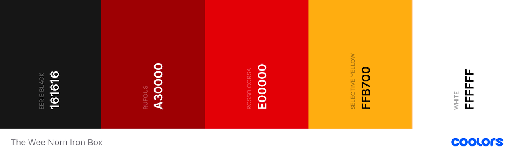
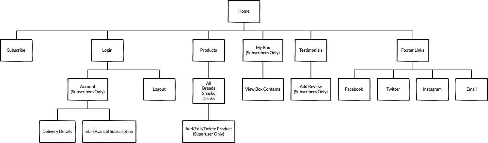

# The Wee Norn Iron Box

The Wee Norn Iron Box is a subscription box service that will allow subscribed members to select different Northern Irish treats to be posted to them each month in a 'wee' box.

Multi Device Website Mockup Generator: **Insert Mockup Generator Image Later**

A demo of the project can be found here: **Insert Heroku Link Later**

## Contents

- [**User Experience**](#user-experience)
  - Project Goals
  - User Stories
    - First Time Visitor
    - Subscriber
    - Superuser
  - Design
    - Colour Scheme
    - Typography
    - Imagery
  - Wireframes

- [**Database Models**](#database-models)

- [**Features**](#features)
  - Existing Features
  - Features left to be implemented

- [**Technologies Used**](#technologies-used)
  - Languages
  - Frameworks, Libraries and Programs
  - Dependencies

- [**Deployment**](#deployment)
  - Github
  - Heroku
  - Cloning the Repository

- [**Credits**](#credits)
  - Code
  - Content
  - Media
  - Acknowledgements

---

## User Experience

### Project Goals

The goal of this project is to create a subscription box service that will allow subscribers to choose from a range of drinks, foods and snacks that are only available in Northern Ireland. The project is aimed at anyone who lives/studies/works abroad or elsewhere in the UK, and misses the taste of home!

For £10 per month and free delivery, subscribers will receive a box each month containing their chosen Northern Irish goods. Subscribers can add the following to their box:

- 2 x drinks
- 2 x baked goods
- 2 x snacks

### User Stories

#### First Time Visitor

- As a **First Time Visitor**, I want to understand the main purpose of the site on my first visit
- As a **First Time Visitor**, I want to be able to easily navigate the site
- As a **First Time Visitor**, I want to be able to easily view/use the site on my smartphone
- As a **First Time Visitor**, I want to be able to see what products are available to add to a subscription box
- As a **First Time Visitor**, I want to know the subscription price
- As a **First Time Visitor**, I want to be able to easily register for an account
- As a **First Time Visitor**, I want to be able to follow the company on social media platforms
- As a **First Time Visitor**, I want to be able to contact the company with any queries I might have

#### Subscriber

- As a **Subscriber**, I want to be able to easily login and logout of my account
- As a **Subscriber**, I want to be able to easily update my details in my profile
- As a **Subscriber**, I want to be able to easily add and remove items from my box
- As a **Subscriber**, I want to be able to easily cancel my subscription
- As a **Subscriber**, I want to be able to leave a review on the site to let others know about my experience

#### Site Owner/Superuser

- As a **Site Owner/Superuser**, I want to be able to add new products
- As a **Site Owner/Superuser**, I want to be able to edit products
- As a **Site Owner/Superuser**, I want to be able to remove products
- As a **Site Owner/Superuser**, I want to be able to view subscribers subscription details so I know when to ship their next box
- As a **Site Owner/Superuser**, I want to be able to view subscribers box contents so I know what products to ship in their next box

### Design

#### Colour Scheme


_Colour palette generated using [coolors.co](https://coolors.co)_

The colour palette for this project is based on the colours of the Harland and Wolff cranes in Belfast, Northern Ireland.

-  `#161616`:
-  `#A30000`:
-  `#E00000`:
-  `#FFB700`:
-  `#FFFFFF`:

#### Typography

Throughout the site, I used two different fonts from Google Fonts. These were [Anton](https://fonts.google.com/specimen/Anton#standard-styles) with the suggested pairing of [Roboto](https://fonts.google.com/specimen/Roboto).

The Anton font was used for all main headings on the site and as the font for the logo text.

#### Imagery

The images used for this project are product images sourced from a variety of different websites. As this project is for educational purposes, I have credited the websites at the bottom of this document in the [credits](#credits) section. The product images used are of well known Northern Irish/Irish brands including [Tayto](https://www.tayto.com/) and [Maine Lemonade](https://www.mainesoftdrinks.co.uk/).

I designed a simple logo for the site using [Affinity Photo](https://affinity.serif.com/en-gb/photo/). The logo is made up of an outline of the map of Northern Ireland and some text with the name of the site - "The Wee Norn Iron Box". I then downloaded a PSD box mock-up from [Free Pik](https://www.freepik.com/) and added the logo as well as some Northern Irish slang to the box to display on the landing page of the site.

#### Wireframes

The wireframes for my site were created using [Balsamiq](https://balsamiq.com/). I created wireframes for mobile, tablet and desktop devices.



Links to the wireframes can be found below. Each link contains the wireframes for mobile, tablet and desktop devices:

- [Home Page](https://github.com/KirstChat/the-wee-norn-iron-box/blob/master/wireframes/home.pdf)
- [Products Page](https://github.com/KirstChat/the-wee-norn-iron-box/blob/master/wireframes/products.pdf)
- [Add/Edit/Delete Products](https://github.com/KirstChat/the-wee-norn-iron-box/blob/master/wireframes/add-edit-delete-products.pdf) _(Superuser Only)_
- User Profile
- Box Contents
- Add Review

[Contents](#contents)

---

## Database Models

[SQLite3](https://www.sqlite.org/index.html) was used in development as part of the Django framework and [Heroku Postgres](https://www.heroku.com/postgres) was used for Production.

- Products App:

Category Model

| Field | Field Type | Field Options |
| :---: | :---: | :---: |
| name | CharField | max_length=200 |

Products Model

| Field | Field Type | Field Options |
| :---: | :---: | :---: |
| name | CharField | max_length=200, null=True |
| description | TextField | null=True, blank=True |
| brand | CharField | max_length=200, null=True, blank=True |
| category | ForeignKey | 'Category', null=True, blank=True, on_delete=models.SET_NULL |
| size | CharField | max_length=25, null=True, blank=True |
| image | ImageField | null=True, blank=True |

[Contents](#contents)

---

## Features

### Features to Include

- Home App:
  - Testimonials Section - Add When User Profiles are Complete
- Products App:
  
- User Profile App:
  - Delivery Details
  - Start/Cancel Subscription
- Box Contents App:
  - ~~Box Contents~~
- Footer Social Media/Email Links:
  - Email

### Existing Features

- An easy to use navigation bar located at the top of every page with a toggle button to trigger the nav on mobile devices
- A home page with an about section that explains the purpose of the site
- A products page with a search bar and a filter by category option
- A footer located on every page with links to social media pages

- Toasts to let the user know when they've successfully completed an action or to let them know if there was a error completing an action

### Features Left to be Implemented

- Blog Feature
- Box Tracking
- Apple/Google Pay
- Skip Month(s)
- Change Shipping Date
- Email Reminders for Shipping/Subscription Payment
- Favourites Section

[Contents](#contents)

---

## Technologies Used

### Languages

- [HTML](https://developer.mozilla.org/en-US/docs/Web/HTML)
- [CSS](https://developer.mozilla.org/en-US/docs/Web/CSS)
- [JavaScript](https://developer.mozilla.org/en-US/docs/Web/JavaScript)
- [Python](https://www.python.org/)

### Frameworks, Libraries and Tools

- [Affinity Photo](https://affinity.serif.com/en-gb/photo/)
  - Affinity Photo was used to design a simple logo for the site and to add the logo to a box mock-up PSD
- [AWS Amazon S3](https://aws.amazon.com/s3/)
  - Amazon S3 _(Amazon Simple Storage Service)_ was used to store static and media files used in the project
- [Balsamiq](https://balsamiq.com/)
  - Balsamiq was used to create the wireframes for desktop, tablet and mobile during the design process
- [Bootstrap](https://getbootstrap.com/docs/5.0/getting-started/introduction/)
  - Bootstrap v5.0 was used to give the site a simple, responsive layout and to also add various Bootstrap components and utilities
- [Django](https://www.djangoproject.com/)
  - Django was the web framework used to build the project
- [Font Awesome](https://fontawesome.com/)
  - Font Awesome was used to add various icons throughout the site
- [Google Fonts](https://fonts.google.com/)
  - Google Fonts was used to add [Anton](https://fonts.google.com/specimen/Anton#standard-styles) and [Roboto](https://fonts.google.com/specimen/Roboto) to the site
- [Git](https://git-scm.com/)
  - Git was used for version control by utilising the terminal in VS Code to commit to Git and push to GitHub. Git was also used to create branches to test new features before merging with the master branch
- [GitHub](https://github.com/)
  - GitHub was used to store the project code that was pushed from VS Code
- [Heroku](https://www.heroku.com/)
  - Heroku is a cloud platform that was used to deploy and run the application from the GitHub repository
- [VS Code](https://code.visualstudio.com/)
  - Visual Studio Code was the editor used to code the project

### Dependencies

- **Update This Throughout**
- [django-allauth](https://django-allauth.readthedocs.io/en/latest/overview.html)
  - Integrated set of Django applications addressing authentication, registration, account management as well as 3rd party (social) account authentication
- [Pillow](https://pillow.readthedocs.io/en/stable/)
  - Python imaging library

[Contents](#contents)

---

## Testing

Further Testing information can be found in a separate document: [TESTING.md](TESTING.md)

[Contents](#contents)

---

## Deployment

This project was developed on macOS using VS Code, with Git and GitHub used for version control. The project is hosted on Heroku, and all static and media files are stored on AWS Amazon S3.

### Cloning the Repository

To clone the repository and make a local copy on your computer, follow these steps:

- Open GitHub and locate the GitHub repository: **Add Link Later**
- Under the repository name, click **"Code"** and copy the link to clone the repository using **"HTTPS"**
- After copying the link, open a terminal on your computer - this step can also be done in the terminal in your preferred IDE or Code Editor
- Change the current working directory to the location where you want the cloned directory to be saved
- Type ```git clone```, and then paste the URL: **Add Link Later**
- Press Enter to create a local clone
- Create a **env.py** file to store environment variables: **Add These Later**
- Add the **env.py** file and the virtual environment folder (**"venv"**) to a **".gitignore"** file to ensure this information isn't pushed to the repository on GitHub
- Before installing any required dependencies, create a virtual environment - this will ensure that packages installed are only installed in the virtual environment folder: ```python3 -m venv venv```
- Run the following command to ensure you are installing packages in the virtual environment and not on your local drive: ```source ./venv/bin/activate```
- Install the required dependencies from the **"requirements.txt"** file to run the repository locally: ```pip3 install requirements.txt```
- Run the app from your local IDE or Code Editor by running the following command in the terminal: ```python3 manage.py runserver```

### GitHub

This project was coded in VS Code and pushed to GitHub using the following steps:

- Create a new folder in your preferred area in your local drive
- Open the folder in VS Code to start creating files
- Open source control in VS Code and select **"Publish to GitHub"**
- If prompted, sign into GitHub to connect your account to VS Code if you haven't done so already
- In source control, select **"Publish to GitHub"**
- Give your repository a name and select **"Publish to GitHub Public Repository"**
- After the repository is successfully published to GitHub, you can use git bash to add, commit and push any changes to the GitHub repository
- To stage a file to commit, use ```git add``` and the name of the file you want to commit or alternatively, use ```git add .``` to add all files to the staging area
- After adding a file to commit, use ```git commit -m "add commit message here"``` to specify what changes you have made to that file
- After committing a file, use ```git push``` to push all staged changes to the GitHub repository

### Heroku

The following steps were used to host the project on Heroku:

- Before creating a Heroku app, open the repository in VS Code and create a requirements file that lists all the applications and dependencies required to run the application: ```pip3 freeze --local > requirements.txt```
- Create a Heroku specific file called a Procfile - this is what Heroku looks for to know which file runs the app and how to run it: ```**Add This Later**```
- Open [Heroku](www.heroku.com) and login to your account or sign up for an account if you don't already have one
- Open the dashboard and select **"New"** to create a new app
- Name the app and set the region to Europe
- Open the settings tab and open **"Reveal Config Vars"**
- Add the environment variables from the **env.py** file:
  - **Add These Later**
- To deploy the app from GitHub, open the deploy tab and change the deployment method to GitHub
- Connect to your GitHub account and search for the name of the repository to connect to
- Once connected, **"Enable Automatic Deployments"** and select the **"Master"** or **"Main"** branch to deploy
- Click the **"Deploy Branch"** button to deploy the app to Heroku

### AWS Amazon S3

The following steps were used to store static files and media files in an Amazon S3 Bucket:

- **Add These Steps Later**

[Contents](#contents)

---

## Credits

### Code

- [Bootstrap Documentation](https://getbootstrap.com/docs/5.0/getting-started/introduction/)
  - The Bootstrap Documentation was used to add different components to the project including a Navbar, Nav Pills and Cards.

- [Code Institute Full Stack Frameworks Boutique Ado Project](https://codeinstitute.net/)
  - The Boutique Ado project walkthrough from the Code Institute Full Stack Development course was used as a guide to help build this project.

- [CSS linear-gradient()](https://developer.mozilla.org/en-US/docs/Web/CSS/linear-gradient())
  - CSS linear-gradient was used to add a gradient background to the card overlay from the cards used in the products app.

- [Django Documentation](https://docs.djangoproject.com/en/3.2/)
  - The Django Documentation was used to...

- [Initialize Bootstrap 5 Toasts](https://stackoverflow.com/questions/63515279/how-to-initialize-toasts-with-javascript-in-bootstrap-5)

- [Get full URL path](https://docs.djangoproject.com/en/3.2/ref/request-response/#django.http.HttpRequest.get_full_path)
  - Return URL with appended query string

- [URL in if statement](https://stackoverflow.com/questions/17829718/url-name-in-django-template-if-statement)
  - Check url path

### Content

All product descriptions and sizes were taken the following sites:

Baked Goods

- All Irwin's Product Descriptions from [Irwin's Bakery](https://www.irwinsbakery.com/)
- Genesis Crafty Wheaten Bread Description from [Hungry Expats](https://www.hungryexpats.com/genesis-toaster-wheaten-420g-262-p.asp)
- Ormo Potato Farls Description from [Hungry Expats](https://www.hungryexpats.com/ekmps/shops/307c11/images/ormo-6-potato-farls-67-p.jpg)
- Ormo Sodas Description from [Sainsburys](https://www.sainsburys.co.uk/gol-ui/product/ormo-soda-farl-bread-x2?catalogId=10241&productId=81192&storeId=10151&langId=44&krypto=w8mOybHx3E14oAOWwLquNudqSC5nXJmKD7E4zmdTS%2FzgHayi9oWwlC1AQ%2BEUwv0brkfgLlYs11qyQYs2w1AJgqB4lsKZHw7LLL8KrP4fG6YTd7TDnz3gjYMkH%2FKwd1YdbbqysfXvk5SS5k7NfoG2MgZ0ElppHf7F7ku6dGeDACdEw6CfnXe7%2BuVem24B%2Fsc4vXe8uYiiCJXuOisuYLM8mQ%3D%3D&ddkey=https%3Agb%2Fgroceries%2Formo-soda-farl-bread-x2)
- Sunblest Veda Bread Description from [Appy Shop](https://appyshop.co.uk/product-images/vl/5010092118502.jpg)

Snacks

- All Tayto Crisp Descriptions from [Tayto](https://www.tayto.com/)

Drinks

- All Dale Farm Sukie Juice Descriptions form [Appy Shop](https://appyshop.co.uk/store-109/shop?page=1&sterm=sukie)
- Club Orange Description from [Hungry Expats](https://www.hungryexpats.com/club-orange-500ml-83-p.asp)
- Club Rock Shandy Description from [Asda](https://groceries.asda.com/product/regular-flavoured-fizzy-drinks/club-rock-shandy/1000033144357)
- Club Lemon Description from [Asda](https://groceries.asda.com/product/soft-drinks-offline/club-lemon-cans/11787282)
- Maine Cloudy Lime Description from [Appy Shop](https://appyshop.co.uk/store-97/food-cupboard/soft-drinks-fruit-juice/maine-cloudy-lime-1l-5011475138766)
- Maine Pineappleade Description from [Appy Shop](https://appyshop.co.uk/store-97/food-cupboard/soft-drinks-fruit-juice/maine-pineappleade-1lt-5011475124639)
- Maine Bubblegum Description from [Asda](https://groceries.asda.com/product/regular-flavoured-fizzy-drinks/maine-bubblegum-drink/910001360405)
- Maine Attaboy Description from [Maine](https://www.mainesoftdrinks.co.uk/shop/attaboy-case/)

### Media

As this project is for educational purposes, the images included in the project have been sourced form a variety of websites as it was difficult to find free to use images of the products I wanted to feature. Links to these websites can be found below:

Baked Goods

- All Irwin's Product Images from [Irwin's](https://www.irwinsbakery.com/)
- Genesis Wheaten Bread Product Image from [Sainsburys](https://www.sainsburys.co.uk/gol-ui/product/soda-rye-bread/genesis-crafty-toaster-wheaten-420g)
- Ormo Potato Farls Product Image from [Hungry Expats](https://www.hungryexpats.com/ekmps/shops/307c11/images/ormo-6-potato-farls-67-p.jpg)
- Ormo Sodas Product Image from [Sainsburys](https://www.sainsburys.co.uk/gol-ui/product/ormo-soda-farl-bread-x2?catalogId=10241&productId=81192&storeId=10151&langId=44&krypto=w8mOybHx3E14oAOWwLquNudqSC5nXJmKD7E4zmdTS%2FzgHayi9oWwlC1AQ%2BEUwv0brkfgLlYs11qyQYs2w1AJgqB4lsKZHw7LLL8KrP4fG6YTd7TDnz3gjYMkH%2FKwd1YdbbqysfXvk5SS5k7NfoG2MgZ0ElppHf7F7ku6dGeDACdEw6CfnXe7%2BuVem24B%2Fsc4vXe8uYiiCJXuOisuYLM8mQ%3D%3D&ddkey=https%3Agb%2Fgroceries%2Formo-soda-farl-bread-x2)
- Sunblest Veda Bread Product Image [Appy Shop](https://appyshop.co.uk/product-images/vl/5010092118502.jpg)

Snacks

- All Tayto Crisps Product Images from [Tayto](https://www.tayto.com/)

Drinks

- All Dale Farm Sukie Juice Product Images from [Appy Shop](https://appyshop.co.uk/)
- BPM Focus Energy Drink Product Image from [Appy Shop](https://appyshop.co.uk/store-62/food-cupboard/soft-drinks-fruit-juice/bpm-focus-energy-drink-red-500ml-5060466513792)
- Club Orange Product Image from [Hungry Expats](https://www.hungryexpats.com/club-orange-500ml-83-p.asp)
- Club Rock Shandy Product Image from [Amazon](https://www.amazon.co.uk/Club-Rock-Shandy-500ml-Pack/dp/B07XBVJ5PZ)
- Club Lemon Product Image from [Amazon](https://www.amazon.co.uk/500-Ml-Club-Lemon-500Ml/dp/B01AG6DKSG)
- Maine Cloudy Lime Product Image from [Appy Shop](https://appyshop.co.uk/store-97/food-cupboard/soft-drinks-fruit-juice/maine-cloudy-lime-1l-5011475138766)
- Maine Pineappleade Product Image from [Appy Shop](https://appyshop.co.uk/store-97/food-cupboard/soft-drinks-fruit-juice/maine-pineappleade-1lt-5011475124639)
- Maine Bubblegum Product Image from [Amazon](https://www.google.com/url?sa=i&url=https%3A%2F%2Fwww.amazon.co.uk%2FMAINE-BUBBLEGUM-500ml-PACK-BUNDLE%2Fdp%2FB00X67NYGQ&psig=AOvVaw0HrI_2O9t0jVeaqAifWFlP&ust=1618927295492000&source=images&cd=vfe&ved=0CA0QjhxqFwoTCOCb7Lm8ivACFQAAAAAdAAAAABAI)
- Maine Attaboy Product Image from [Facebook](https://www.facebook.com/MaineSoftDrinkssince1949/photos/a.2109344979077091/3967839029894334/?type=3)

Other Images

- Northern Ireland Map Outline used for the Logo[Clean PNG](https://www.cleanpng.com/png-flag-of-northern-ireland-vector-map-ireland-779814/preview.html)
- Box Mock-Up used on the Home Page [Free Pik](https://www.freepik.com/free-psd/delivery-man-handing-box-client_10109726.htm)
- Ulster Fry used on Products Page [The Culture Trip](https://theculturetrip.com/europe/united-kingdom/northern-ireland/articles/a-brief-history-of-the-ulster-fry/)

### Acknowledgements

[Contents](#contents)

---
