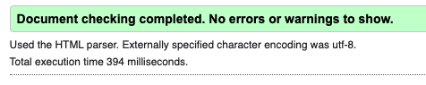
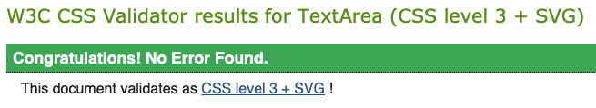
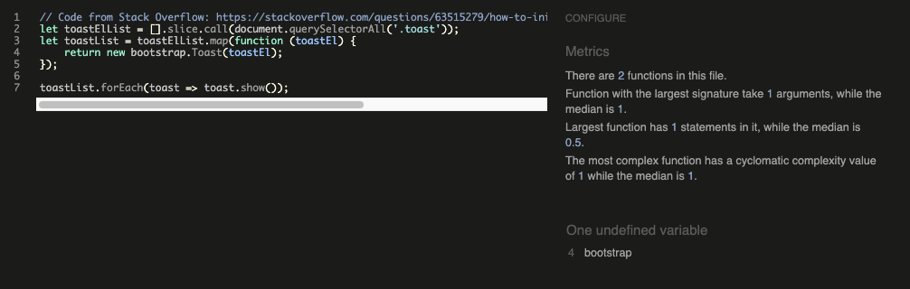
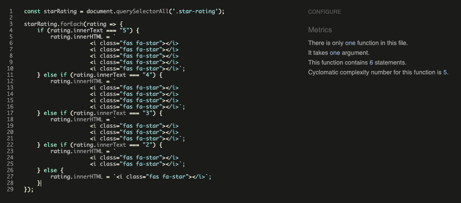
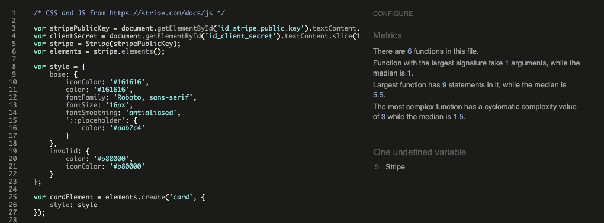
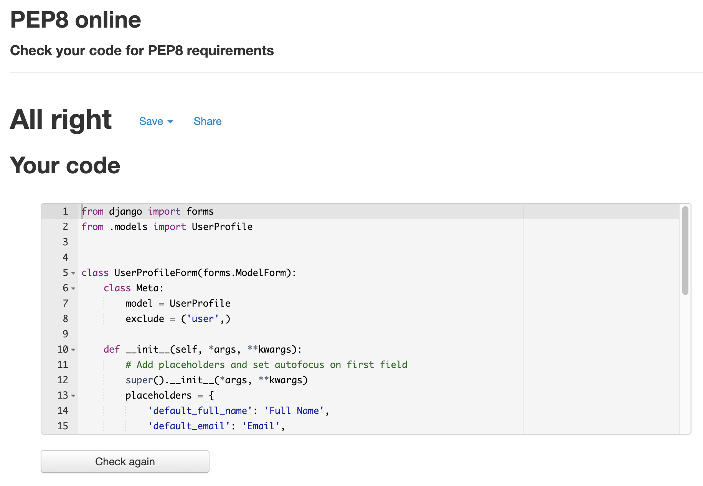

# Testing for The Wee Norn Irish Box

## Contents

- [Code Validation](#code-validation)
- [User Stories](#user-stories)
- [Branches](#branches)
- [Responsiveness](#responsiveness)
- [Performance](#performance)
- [Manual Testing](#manual-testing)
- [Known Bugs](#known-bugs)
- [Other Issues](#other-issues)

---

## Code Validation

The [W3C Markup Validator](https://validator.w3.org/) and the [W3C CSS Validator](https://jigsaw.w3.org/css-validator/) were used to validate the HTML and CSS files in the project and check there were no syntax errors. The following shows the results for each page:

[W3C Markup Validator](https://validator.w3.org/)

Products page displayed a bad value error for spaces in the subject line of mailto

- This was fixed by replacing all the spaces in the subject line with %20

After fixing the error on the products page, I ran all the pages through the validator again to check there were no other errors or warnings to show:

[W3C CSS Validator](https://jigsaw.w3.org/css-validator/)

There were no errors displayed after running all css files through the validator but there were warnings for the use of colour variables which can be ignored:

[JS Hint](https://jshint.com/) was used to check that the JavaScript code in the project complies with coding rules and to check for any syntax errors:

Found one undefined variable in initialise_toasts.js:

Found no errors in star_ratings.js:

Found one undefined variable in stripe_elements.js:

[PEP8 Online](http://pep8online.com/) was used to check that the Python code meets PEP8 requirements:

As well as using linting in VS Code to check python code, I also ran all custom python files through PEP8 online which found no errors:

[Contents](#contents)

---

## User Stories

### First Time Visitor

As a **First Time Visitor**, I want to understand the main purpose of the site on my first visit:

As a **First Time Visitor**, I want to be able to easily navigate the site:

As a **First Time Visitor**, I want to be able to easily view/use the site on my smartphone:

As a **First Time Visitor**, I want to be able to see what products are available to add to a snack box:

As a **First Time Visitor**, I want to know the snack box price:

As a **First Time Visitor**, I want to be able to read blog posts:

As a **First Time Visitor**, I want to be able to easily register for an account:

As a **First Time Visitor**, I want to be able to follow the company on social media platforms:

As a **First Time Visitor**, I want to be able to contact the company with any queries I might have:

### Registered User

As a **Registered User**, I want to be able to easily login and logout of my account:

As a **Registered User**, I want to be able to easily add and remove items from my box:

As a **Registered User**, I want to be able to easily purchase my box:

As a **Registered User**, I want to receive an email confirming my purchase:

As a **Registered User**, I want to be able to easily update my delivery details in my profile:

As a **Registered User**, I want to be able to view my order history:

As a **Registered User**, I want to be able to easily submit blog posts:

As a **Registered User**, I want to be able to easily edit or delete any blog posts I've submitted:

As a **Registered User**, I want to be able to comment on other blog posts:

As a **Registered User**, I want to be able to leave a review on the site to let others know about my experience:

[Contents](#contents)

---

## Branches

Throughout the development process, different branches have been created to test different features and layouts which have now been merged with the master branch.

Reviews Branch:

- This branch was created to create the reviews app in the project and was also used to test the views in the home app to ensure that the reviews displayed properly on the home page

Stripe Branch:

- This branch was originally created to test stripe subscriptions
- After creating subscription models, views and adding stripe elements, I was unable to successfully setup stripe subscriptions so opted for a stripe one-time payment option instead

View Box Branch:

- This branch was created to test viewing the box items in the box app and also in the success toast when a user has successfully added an item to their box

[Contents](#contents)

---

## Responsiveness

As well as running each page through a validator and testing user stories to see if they were met, I also tested the responsiveness of the site across a number of different devices and browsers:

- Chrome DevTools was used during the development process to test the responsiveness of the site on different devices before pushing any changes to GitHub
- After pushing changes to GitHub, the site was also tested in Firefox and Safari
- The site was also tested across a number of personal devices including an iPad, iPhone 11 and MacBook Pro
- A desktop app called [Responsively](https://responsively.app/) was also used to check the responsiveness of the site on some additional android devices that I didn't have access to on Chrome DevTools

[Contents](#contents)

---

## Performance

As well as testing the responsiveness of the site, I also tested the performance of each page using [Lighthouse](https://developers.google.com/web/tools/lighthouse) in Chrome DevTools.

[Contents](#contents)

---

## Manual Testing

[Contents](#contents)

---

## Known Bugs

Reviews App:

- Registered users are able to post more than one review

[Contents](#contents)

---

## Other Issues

Stripe Subscription:

- The original idea for this project was to create a subscription service that would allow subscribers to receive their snack box each month
- While trying to implement a stripe subscription plan, I was unable to generate any successful payments
- Due to work commitments/project submission deadline impending, I opted for my back-up plan of a one time payment option, keeping the same price of £10 per box that contains 6 items chosen by the user

[Contents](#contents)

---
