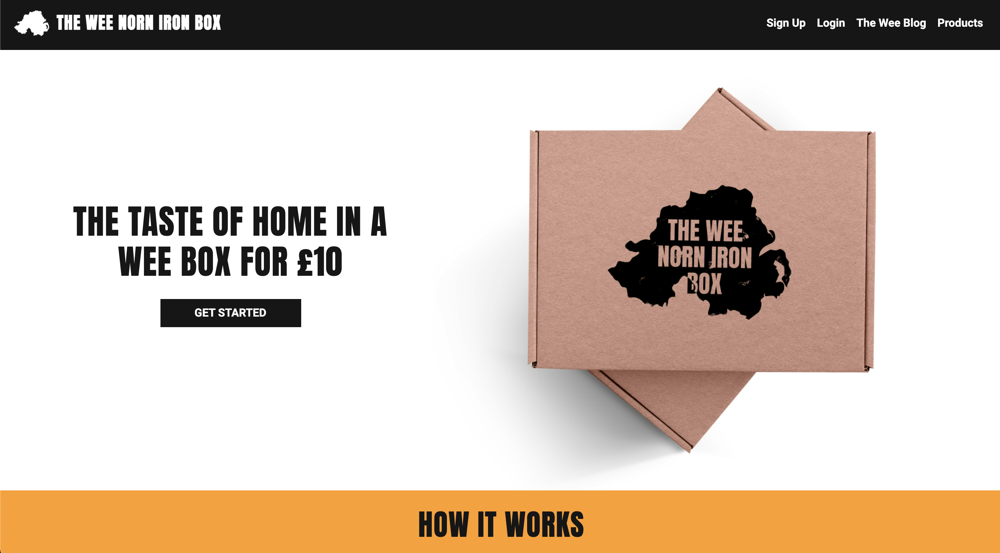
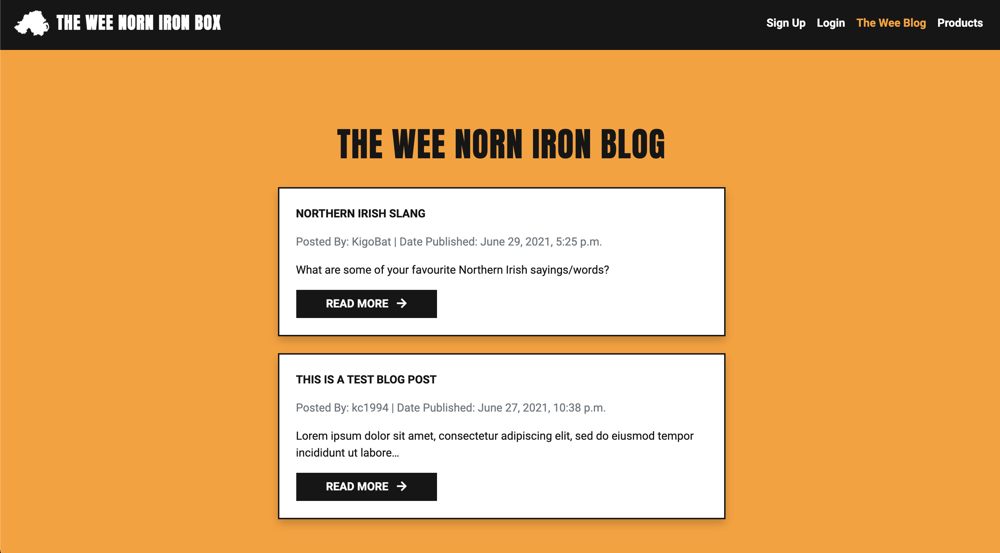
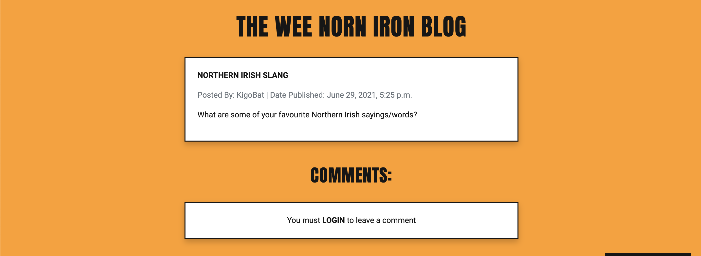
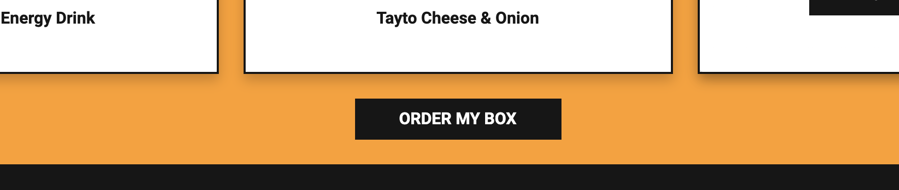
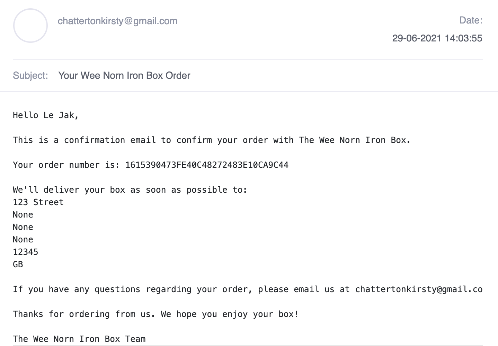
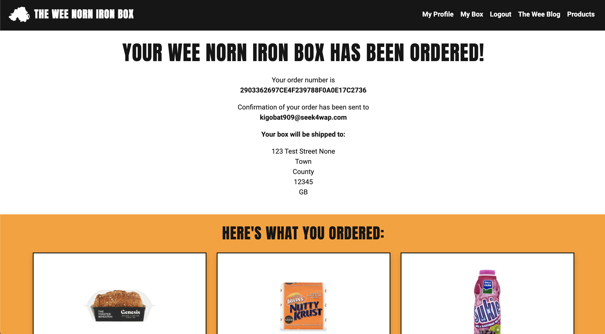

# Testing for The Wee Norn Irish Box

## Contents

- [Code Validation](#code-validation)
- [User Stories](#user-stories)
- [Branches](#branches)
- [Responsiveness](#responsiveness)
- [Performance](#performance)
- [Manual Testing](#manual-testing)
- [Known Bugs](#known-bugs)
- [Other Issues](#other-issues)

---

## Code Validation

The [W3C Markup Validator](https://validator.w3.org/) and the [W3C CSS Validator](https://jigsaw.w3.org/css-validator/) were used to validate the HTML and CSS files in the project and check there were no syntax errors. The following shows the results for each page:

[W3C Markup Validator](https://validator.w3.org/):

Products page displayed a bad value error for spaces in the subject line of mailto

- This was fixed by replacing all the spaces in the subject line with %20

After fixing the error on the products page, I ran all the pages through the validator again to check there were no other errors or warnings to show:

[W3C CSS Validator](https://jigsaw.w3.org/css-validator/):

There were no errors displayed after running all css files through the validator but there were warnings for the use of colour variables which can be ignored:

[JS Hint](https://jshint.com/) was used to check that the JavaScript code in the project complies with coding rules and to check for any syntax errors:

Found one undefined variable in initialise_toasts.js:

Found no errors in star_ratings.js:

Found one undefined variable in stripe_elements.js:

[PEP8 Online](http://pep8online.com/) was used to check that the Python code meets PEP8 requirements:

[Contents](#contents)

---

## User Stories

### First Time Visitor

As a **First Time Visitor**, I want to understand the main purpose of the site on my first visit:

- I've included a short description in the heading section below the navigation bar of the site as well as a section to explain how the site works

_Descriptions on Home Page_

As a **First Time Visitor**, I want to be able to easily navigate the site:

- I've included a navigation bar at the top of all pages to provide links to other pages in the site
- I've also included various buttons throughout the site that also link to other pages
- I've added external links to social media pages in the footer that will open in a new tab/window

_Navigation Bar_

As a **First Time Visitor**, I want to be able to easily view/use the site on my smartphone:

- I've used [Bootstrap 5](https://getbootstrap.com/) to make the site responsive across multiple devices including mobile and tablets
- The site has been tested across multiple devices to ensure it is [responsive](#responsiveness)

As a **First Time Visitor**, I want to be able to see what products are available to add to a snack box:

- I've included a link to the products page in the navigation bar that allows first time visitors see what products are available to add to a box before they register for an account to make a purchase

_Products Page_

As a **First Time Visitor**, I want to know the snack box price:

- I've included the price of the box on the home page in the heading section as well as in the section that explains how the site works

As a **First Time Visitor**, I want to be able to read blog posts:

- I've included a link to the blog page in the navigation bar that allows first time visitors to read posts
- Without an account, they won't have permission to add any posts or comment on any posts

_Blog Post_

_Comments Section_

As a **First Time Visitor**, I want to be able to easily register for an account:

- I've included a link to the sign up page in the navigation bar that allows first time visitors to create an account
- After signing up for an account, the user will receive a verification email which will allow them finish signing up for their account when they follow the link in the email

_Sign Up Form_

_Verify Email_

As a **First Time Visitor**, I want to read reviews from other users:

- I've included a reviews section on the home page so they can read about other peoples experience using the service

_Reviews_

As a **First Time Visitor**, I want to be able to follow the company on social media platforms:

- I've included links to social media platforms in the footer of the site
- These links will open in a new tab/window when opened

_Footer_

As a **First Time Visitor**, I want to be able to contact the company with any queries I might have:

- I've included an email link in the products page to allow users to contact the site owner to request any products they'd like to see available in the future

_Email Link_

### Registered User

As a **Registered User**, I want to be able to easily login and logout of my account:

- I've included a link to the login page in the navigation bar and a link for logged in users to logout of their account

_Login Page_

As a **Registered User**, I want to be able to easily add and remove items from my box:

- On the products page, I've add a button to each product to allow the user to easily add that product to their box
- On the view box page, I've add a remove button to each product to allow the user to easily remove a product from their box

_Add Product_

_Remove Product_

As a **Registered User**, I want to be able to easily purchase my box:

- I've added an order my box button which displays in the view box page when the user has added 6 items to their box
- The user will be directed to a checkout page where they can enter their delivery and payment information

_Order Button_

_Checkout Page_

As a **Registered User**, I want to receive an email confirming my purchase:

- When a user has successfully ordered their box, they will receive an email to confirm their order
- I've also set up a checkout success page that the user will see when their order is successful which will display all their order details

_Email Confirmation_

_Checkout Success Page_

As a **Registered User**, I want to be able to easily update my delivery details in my profile:

- On the checkout page, I've provided the user with the option to save their delivery address for quicker checkout in the future
- If the user chooses this option, their delivery address will be saved to their profile and they can update these details at anytime

_Delivery Address Update_

As a **Registered User**, I want to be able to view my order history:

- I've added an order history section to the user's profile which displays all of the users previous orders
- The user is able to click on the order number to view their full order details which will display a page similar to the checkout success page

_Order History_

As a **Registered User**, I want to be able to easily submit blog posts:

- I've created a blog page that allows registered users to add their own posts

_Add Blog Post_

As a **Registered User**, I want to be able to easily edit or delete any blog posts I've submitted:

- I've added edit and delete buttons to allow registered users to edit or delete any of their own posts

_Edit or Delete Post Buttons_

As a **Registered User**, I want to be able to comment on other blog posts:

- I've provided a comment section on each post to allow registered users to comment on posts

_Blog Post Comments_

As a **Registered User**, I want to be able to leave a review on the site to let others know about my experience:

- I've added a button to the reviews section on the home page to allow registered users to leave a review

_Add Review Form_

### Site Owner/Superuser User

As a **Site Owner/Superuser**, I want to be able to add new products:

- I've add an 'Add New Product' button on the products page that is only available to the superuser

_Add New Product Button_

As a **Site Owner/Superuser**, I want to be able to edit and delete products

- I've added an edit button and a delete button to each of the products that is only available to the superuser

_Edit/Delete Product Button_

As a **Site Owner/Superuser**, I want to be able to manage user reviews:

- I've add a manage reviews page that allows the superuser to view all reviews and remove any that may be inappropriate

_Manage Reviews Page_

As a **Site Owner/Superuser**, I want to be able to view and manage all blog posts:

- I've added permissions for the superuser to be able to edit and delete any of the blog posts on the site

_Edit/Delete Blog Post_

As a **Site Owner/Superuser**, I want to be able to access the admin panel to view registered users order details so I know what products to add to their box:

- I've included a link in the navigation bar to the django admin panel

_Admin Navigation Bar_

[Contents](#contents)

---

## Branches

Throughout the development process, different branches have been created to test different features and layouts which have now been merged with the master branch.

Reviews Branch:

- This branch was used to create the reviews app in the project and was also used to test the views in the home app to ensure that the reviews displayed properly on the home page

Stripe Branch:

- This branch was originally created to test stripe subscriptions
- After creating subscription models, views and adding stripe elements, I was unable to successfully setup stripe subscriptions so opted for a stripe one-time payment option instead to meet the project requirements

View Box Branch:

- This branch was used to test viewing the box items in the box app and also in the success toast when a user has successfully added an item to their box

[Contents](#contents)

---

## Responsiveness

As well as running each page through a validator and testing user stories to see if they were met, I also tested the responsiveness of the site across a number of different devices and browsers:

- Chrome DevTools was used during the development process to test the responsiveness of the site on different devices before pushing any changes to GitHub
- After pushing changes to GitHub, the site was also tested in Firefox and Safari
- The site was also tested across a number of personal devices including an iPad, iPhone 11 and MacBook Pro
- A desktop app called [Responsively](https://responsively.app/) was also used to check the responsiveness of the site on some additional android devices that I didn't have access to on Chrome DevTools

[Contents](#contents)

---

## Performance

As well as testing the responsiveness of the site, I also tested the performance of each page using [Lighthouse](https://developers.google.com/web/tools/lighthouse) in Chrome DevTools. After generating reports for both desktop and mobile, the site performed better on desktop than on mobile, with mobile performances scores ranging between 60 - 90 depending on the page. The CDN links used in the site appeared to have brought down the overall performance score but these links are required for Google Fonts, Font Awesome and Bootstrap. The accessibility, best practices and SEO scores on both mobile and desktop ranged between 87 - 95.

Desktop Performance:

Mobile Performance:

[Contents](#contents)

---

## Manual Testing

Each page has been tested individually to check that:

- Images load properly
- Navigation buttons link to the correct pages in the site
- External links located in the footer open in a new tab/window and link to the correct site
- First time visitors only have access to the:
  - home page where they can only read reviews
  - sign up page
  - login page
  - blog page but are unable to add any posts or comments
  - products page but are unable to purchase/add products to a box
- Registered users have access to the:
  - home page where they can add a review
  - login page to login to their account
  - profile page to view their order history, blog drafts and to update their default delivery address
  - products page to add products to their box
  - box page to view products they have added to their box
  - checkout page to purchase their box followed by the checkout success page when they've completed a purchase
  - blog page to read, add and comment on posts as well as edit or delete any posts they've published
  - logout page to logout of their account
- The Site Owner/Superuser has access to the:
  - django admin panel
  - manage reviews page to manage reviews posted by users
  - products page to add, edit and delete products
  - blog page to edit and delete blog posts by all users
- Toasts display when:
  - a user signs up, signs in or signs out of their account
  - a user adds a product to their box
  - a user has reached the item count limit in their box
  - a user successfully orders their box
  - a user adds a review, blog post or comment
  - a user edits or deletes a blog post
  - a user tries to access or use an admin only page or function
  - admin adds, edits or deletes a product
  - admin adds or edits a blog post
  - admin deletes a blog post or a review

Stripe payments were also tested by sending test webhooks from the Stripe dashboard:

_Stripe Test Webhook_

Emails were tested by creating an account using a temporary email address on [Temp Mail](https://temp-mail.org/en). Emails were successfully sent when:

- Verifying the email address for a new account that was created

- Completing an order

[Contents](#contents)

---

## Known Bugs

There are some minor bugs currently present that could be fixed in future release and with more experience using Python and Django.

Reviews App:

- Registered users are able to post more than one review but should only be able to post one review

[Contents](#contents)

---

## Other Issues

Stripe Subscription:

- The original idea for this project was to create a subscription service that would allow subscribers to receive their snack box each month
- While trying to implement a stripe subscription plan, I was unable to generate any successful payments
- Due to work commitments/project submission deadline impending, I opted for my back-up plan of a one time payment option, keeping the same price of £10 per box that contains 6 items chosen by the user

[Contents](#contents)

---
